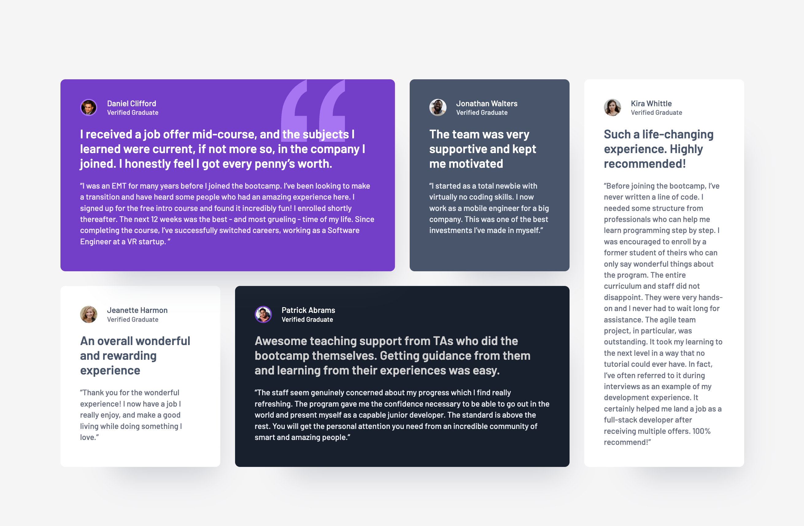

# Frontend Mentor - Testimonials grid section solution

This is a solution to the [Testimonials grid section challenge on Frontend Mentor](https://www.frontendmentor.io/challenges/testimonials-grid-section-Nnw6J7Un7). Frontend Mentor challenges help you improve your coding skills by building realistic projects.

## Table of contents

-   [Frontend Mentor - Testimonials grid section solution](#frontend-mentor---testimonials-grid-section-solution)
    -   [Table of contents](#table-of-contents)
    -   [Overview](#overview)
        -   [The challenge](#the-challenge)
        -   [Screenshot](#screenshot)
        -   [Links](#links)
    -   [My process](#my-process)
        -   [Built with](#built-with)
        -   [What I learned](#what-i-learned)
        -   [Continued development](#continued-development)
        -   [Useful resources](#useful-resources)
    -   [Author](#author)

## Overview

### The challenge

Users should be able to:

-   View the optimal layout for the site depending on their device's screen size

### Screenshot

### Links

-   Solution URL: [https://github.com/EmLopezDev/Testimonials-Grid-Section](https://github.com/EmLopezDev/Testimonials-Grid-Section)
-   Live Site URL: [https://emlopezdev.github.io/Testimonials-Grid-Section/](https://emlopezdev.github.io/Testimonials-Grid-Section/)

## My process

### Built with

-   Semantic HTML5 markup
-   SCSS custom properties, functions and mixins
-   Flexbox
-   CSS Grid

### What I learned

-   The bigges learn was how to use CSS Grid. I would say I still have some more practice to do especially when it comes to making it responsive. I think I could have definitely optimized my solution but will look forward to any feedback I can grow from.

### Continued development

-   Continue working on responsive layouts
-   Practicing more using CSS grid

### Useful resources

-   [CSS Grid](https://www.youtube.com/watch?v=xI9G0Zh5DVA&t=670s) - This helped get a bit of a better understanding of CSS Grid.
-   [CSS Grid 2](https://css-tricks.com/snippets/css/complete-guide-grid/) - A more indepth look at CSS grid.

## Author

-   Frontend Mentor - [@EmLopezDev](https://www.frontendmentor.io/profile/EmLopezDev)
